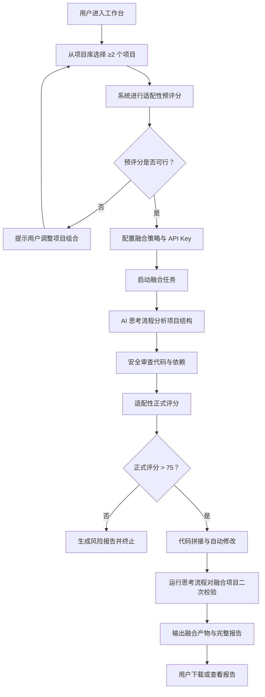

# 项目融合工坊（ProjectFusion）产品需求文档

## 1. 产品概述

项目融合工坊是一款内置 AI 能力的开源项目智能融合工具，用户最少选择两个开源项目，系统会自动进行适配性评分、安全审查、思考流程分析与代码拼接，最终输出一个融合后的新项目。
- 目标用户：开源开发者、全栈工程师、技术探索者
- 核心价值：降低多项目整合门槛，借助 AI 思考流程与安全审查，让"1+1>2"的项目融合成为可能

## 2. 核心功能

### 2.1 用户角色

| 角色 | 注册方式 | 核心权限 |
|------|----------|----------|
| 普通用户 | 直接使用 | 项目选择、融合配置、查看评分与审查报告、下载融合产物 |
| 高级用户 | 配置 API Key | 自定义 AI 模型、调整审查策略、批量融合任务 |

### 2.2 功能模块

1. **工作台首页**：AI 状态展示、项目库浏览、融合任务入口
2. **项目选择页**：多选开源项目（最少 2 个）、查看项目详情、适配性预评分
3. **融合配置页**：融合策略、安全审查级别、思考流程深度、API Key 配置
4. **融合执行页**：实时思考流程可视化、安全审查进度、代码拼接日志
5. **融合报告页**：适配性评分卡、安全审查报告、融合产物下载、差异对比

### 2.3 页面详情

| 页面名称 | 模块名称 | 功能描述 |
|----------|----------|----------|
| 工作台首页 | Hero 区 | 玻璃质感标题、AI 状态呼吸动画、融合入口 CTA |
| 工作台首页 | 项目库 | 卡片式项目展示、悬停玻璃高光、快速加入融合 |
| 工作台首页 | 任务时间线 | 最近融合任务、状态徽章、点击查看报告 |
| 项目选择页 | 项目网格 | 多选交互、最少 2 个校验、实时选中计数 |
| 项目选择页 | 适配性预评分 | 双项目雷达图、维度对比、融合建议 |
| 融合配置页 | 策略面板 | 融合模式（保守/平衡/激进）、安全级别滑块 |
| 融合配置页 | API Key 配置 | 内置 Key 输入、模型选择、连接测试 |
| 融合执行页 | 思考流程可视化 | 节点流式动画、当前步骤高亮、日志流 |
| 融合执行页 | 安全审查面板 | 风险等级仪表盘、问题清单、阻断/放行 |
| 融合报告页 | 评分卡 | 总分大数字、维度环形图、75 分阈值提示 |
| 融合报告页 | 产物下载 | 文件树预览、单文件下载、整包下载 |

## 3. 核心流程

用户从项目库选择 ≥2 个开源项目 → 系统进行适配性预评分 → 用户配置融合策略与 API Key → 启动融合：AI 思考流程分析 → 安全审查 → 适配性正式评分 → 评分 > 75 则进入代码拼接与自动修改 → 输出融合产物与报告。

## 4. 用户界面设计

### 4.1 设计风格

- **主色调**：深邃午夜蓝（#0A0E27）为底，搭配极光紫（#7C5CFF）与冰晶青（#5CE1E6）作为强调色
- **玻璃质感**：全局采用 `backdrop-filter: blur()` 毛玻璃效果，半透明卡片 + 1px 内发光边框
- **按钮风格**：胶囊形按钮、渐变背景、悬停时光晕扩散、点击微缩放
- **字体**：标题使用 SF Pro Display 风格（fallback: -apple-system, PingFang SC），正文使用 SF Pro Text
- **布局**：顶部毛玻璃导航栏 + 居中内容容器 + 卡片式信息块
- **动画**：页面切换淡入淡出、卡片悬停 3D 倾斜、数字滚动动画、思考流程节点流式点亮
- **图标**：Lucide 线性图标，统一 1.5px 描边

### 4.2 页面设计概览

| 页面名称 | 模块名称 | UI 元素 |
|----------|----------|----------|
| 工作台首页 | Hero 区 | 大标题渐变文字、AI 状态呼吸圆点、玻璃 CTA 按钮 |
| 工作台首页 | 项目库 | 3 列玻璃卡片网格、悬停光斑跟随、加入融合徽章 |
| 项目选择页 | 项目网格 | 多选勾选动画、选中卡片高亮边框、底部固定操作栏 |
| 项目选择页 | 雷达图 | SVG 雷达图、维度标签、融合可行性提示 |
| 融合配置页 | 策略面板 | 分段控件、滑块、玻璃开关 |
| 融合配置页 | API Key | 输入框带连接状态指示灯、模型下拉、测试按钮 |
| 融合执行页 | 思考流程 | 垂直时间线、节点流式点亮、当前步骤脉冲动画 |
| 融合执行页 | 安全审查 | 半圆仪表盘、风险条形图、问题折叠面板 |
| 融合报告页 | 评分卡 | 巨大数字滚动、环形进度条、维度列表 |
| 融合报告页 | 产物下载 | 文件树组件、下载按钮、复制路径 |

### 4.3 响应式

- 桌面优先设计，断点：1280px / 1024px / 768px
- 移动端：项目网格降为单列、配置面板改为手风琴、思考流程横向滚动
- 触摸优化：卡片悬停效果在触摸设备改为长按预览

### 4.4 动效细节

- 页面加载：标题字符逐字浮现 + 背景极光渐变流动
- 卡片悬停：3D 倾斜（perspective 1000px）+ 鼠标位置光斑
- 数字变化：CountUp 滚动动画，缓动函数 ease-out-cubic
- 思考流程：节点依次点亮，连线流光动画，当前节点呼吸放大
- 玻璃质感：背景模糊 + 噪点纹理叠加 + 边缘高光
