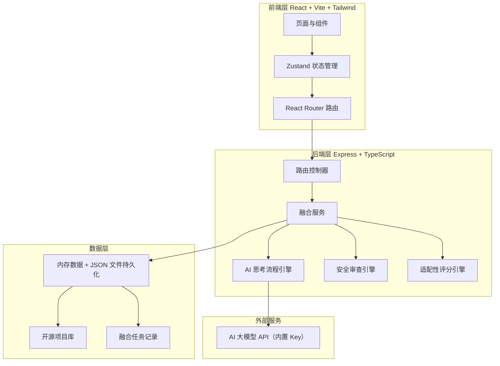
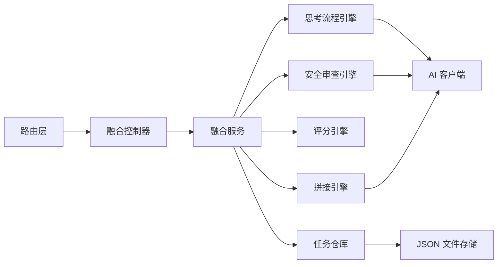
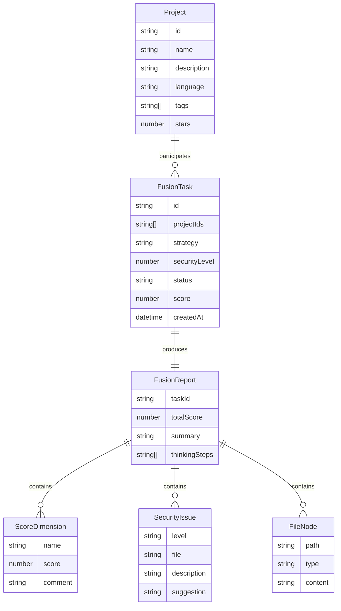

# 项目融合工坊（ProjectFusion）技术架构文档

## 1. 架构设计



## 2. 技术说明

- **前端**：React@18 + TypeScript + tailwindcss@3 + vite + zustand + react-router-dom
- **初始化工具**：vite-init（react-express-ts 模板）
- **后端**：Express@4 + TypeScript（ESM）
- **数据存储**：内存数据 + JSON 文件持久化（无需外部数据库）
- **AI 集成**：内置 API Key，支持 OpenAI 兼容协议；前端可覆盖自定义 Key
- **动画库**：framer-motion（React 动画）+ CSS keyframes（玻璃质感与流光）

## 3. 路由定义

| 路由 | 用途 |
|------|------|
| `/` | 工作台首页：AI 状态、项目库、任务时间线 |
| `/select` | 项目选择页：多选项目、适配性预评分 |
| `/configure` | 融合配置页：策略、安全级别、API Key |
| `/execute/:taskId` | 融合执行页：思考流程、安全审查、代码拼接 |
| `/report/:taskId` | 融合报告页：评分卡、审查报告、产物下载 |

## 4. API 定义

### 4.1 项目库

```typescript
// 获取项目库列表
GET /api/projects
Response: Project[]

// 获取项目详情
GET /api/projects/:id
Response: Project
```

### 4.2 适配性评分

```typescript
// 预评分（选择项目后即时调用）
POST /api/score/preview
Body: { projectIds: string[] }
Response: { totalScore: number; dimensions: ScoreDimension[]; feasible: boolean }
```

### 4.3 融合任务

```typescript
// 创建融合任务
POST /api/fusion/tasks
Body: {
  projectIds: string[];
  strategy: 'conservative' | 'balanced' | 'aggressive';
  securityLevel: number; // 1-5
  apiKey?: string; // 可选自定义 Key
  model?: string;
}
Response: { taskId: string }

// 获取任务状态与流式日志
GET /api/fusion/tasks/:taskId
Response: {
  taskId: string;
  status: 'pending' | 'thinking' | 'reviewing' | 'scoring' | 'merging' | 'done' | 'failed';
  currentStep: string;
  score?: number;
  logs: LogEntry[];
  report?: FusionReport;
}

// 获取融合产物文件树
GET /api/fusion/tasks/:taskId/artifacts
Response: { files: FileNode[] }

// 下载单个文件
GET /api/fusion/tasks/:taskId/artifacts/:path
Response: file stream

// 下载整包
GET /api/fusion/tasks/:taskId/download
Response: zip stream
```

### 4.4 API Key 测试

```typescript
POST /api/ai/test
Body: { apiKey: string; model?: string }
Response: { ok: boolean; message: string; model?: string }
```

## 5. 服务端架构图



## 6. 数据模型

### 6.1 数据模型定义



### 6.2 数据定义

项目库初始化数据存储于 `api/data/projects.json`，融合任务记录存储于 `api/data/tasks.json`。启动时加载到内存，变更时写回文件。

```typescript
// 项目类型定义
interface Project {
  id: string;
  name: string;
  description: string;
  language: string;
  tags: string[];
  stars: number;
  license: string;
  readme: string;
}

// 评分维度
interface ScoreDimension {
  name: string;        // 维度名称：架构兼容性、依赖冲突、许可证兼容、代码风格、文档完整度
  score: number;       // 0-100
  comment: string;
}

// 安全问题
interface SecurityIssue {
  level: 'low' | 'medium' | 'high' | 'critical';
  file: string;
  description: string;
  suggestion: string;
}

// 融合报告
interface FusionReport {
  taskId: string;
  totalScore: number;
  summary: string;
  thinkingSteps: string[];
  dimensions: ScoreDimension[];
  issues: SecurityIssue[];
  files: FileNode[];
}
```
