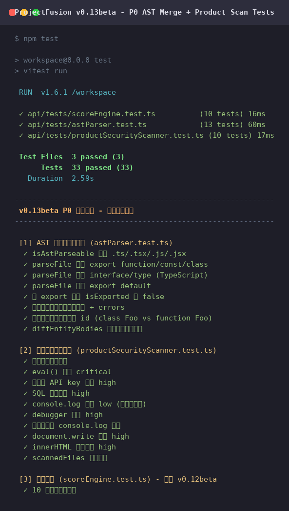

# ProjectFusion · 项目融合工坊

> **v0.13beta** · An AI-powered open-source project fusion workbench with built-in API key, adaptability scoring, security review, and intelligent code merging.
> **v0.13beta** · 一款内置 AI 与 API Key 的开源项目智能融合工坊，提供适配性评分、安全审查与代码拼接能力。


---

## ✨ Features / 功能特性

### English

- **Desktop Client** — Built with Go + Wails v2, ships as a native desktop app (no browser needed).
- **User Authentication** — Register/login with bcrypt-encrypted password storage in SQLite.
- **One-Click Login & Remember Password** — 30-day remember token for passwordless re-entry.
- **Modular Layout** — No main page; each module (fusion, upload, history, settings) is an independent block.
- **File Upload Fusion** — Upload your own project zip files for fusion, alongside built-in demo projects.
- **Built-in AI with API Key** — Ships with a built-in API key (demo mode) and supports custom keys for production use.
- **Multi-Project Fusion** — Select at least 2 open-source projects to fuse into one.
- **Adaptability Scoring** — 5-dimension scoring (architecture, dependencies, license, code style, docs) with a 75-point threshold.
- **AI Thinking Process** — A large language model analyzes project structures and produces a fusion plan.
- **Security Review** — Rule-based scanning plus AI deep inspection for dependency, license, and injection risks.
- **Automatic Code Merging** — When the score exceeds 75, the system automatically generates the fused project file tree and runs a verification pass.
- **Glassmorphism UI** — Apple-inspired design with aurora gradients, glass cards, 3D hover tilt, and fluid animations.
- **Bilingual README & Chinese Code Comments** — Full English/Chinese documentation and concise Chinese comments throughout the codebase.

### 中文

- **桌面客户端** — 基于 Go + Wails v2 构建，原生桌面应用，无需浏览器。
- **用户认证** — 注册/登录，密码采用 bcrypt 加密后存入 SQLite。
- **一键登录与记住密码** — 30 天记住令牌，免密再次进入。
- **模块化布局** — 无主页，每个模块（融合、上传、历史、设置）均为独立区块。
- **文件上传融合** — 可自行上传项目 zip 压缩包进行融合，内置项目保留用于演示。
- **内置 AI 与 API Key** — 自带演示用 API Key，同时支持用户自定义 Key 接入生产模型。
- **多项目融合** — 最少选择两个开源项目，融合为一个新项目。
- **适配性评分** — 五维度评分（架构兼容性、依赖冲突、许可证、代码风格、文档完整度），75 分为融合阈值。
- **AI 思考流程** — 大模型分析项目结构，输出融合规划与思考步骤。
- **安全审查** — 规则扫描 + AI 深度审查，识别依赖漏洞、许可证冲突与代码注入风险。
- **自动代码拼接** — 评分高于 75 分时自动生成融合项目文件树，并运行二次校验思考流程。
- **玻璃质感界面** — 苹果风格设计，极光渐变背景、玻璃卡片、3D 悬停倾斜与流光动画。
- **双语 README 与中文注释** — 完整中英文文档，代码内附清晰简洁的中文注释。

---

## 🧠 Fusion Workflow / 融合流程

```
Select ≥2 projects → Preview scoring → Configure strategy & API Key
  → AI thinking process → Security review → Formal adaptability scoring
  → Score > 75? → Code merging → Verification thinking → Output report & artifacts
```

```
选择 ≥2 个项目 → 预评分 → 配置策略与 API Key
  → AI 思考流程 → 安全审查 → 适配性正式评分
  → 评分 > 75？ → 代码拼接 → 二次校验 → 输出报告与产物
```

---

## 🛠 Tech Stack / 技术栈

| Layer / 层 | Technology / 技术 |
|---|---|
| Desktop Framework / 桌面框架 | Wails v2 (Go + Webview) |
| Backend / 后端 | Go 1.25 (pure Go, no cgo) |
| Auth / 认证 | bcrypt + SQLite (modernc.org/sqlite) |
| Frontend / 前端 | React 18 + TypeScript + Vite + Tailwind CSS 3 |
| State / 状态管理 | Zustand |
| Animation / 动画 | Framer Motion + CSS Keyframes |
| Icons / 图标 | lucide-react |
| AI / 大模型 | OpenAI-compatible API (built-in key + custom key) |

---

## 🚀 Quick Start / 快速开始

### ⚡ One-Click Setup (Recommended) / 一键安装（推荐）

The project includes an automated setup script that detects and installs all dependencies (Go, Node.js, Wails CLI, system libs) with a progress bar.

项目自带自动化安装脚本，会自动检测并安装所有依赖（Go、Node.js、Wails CLI、系统库），带进度条显示。

**Linux / macOS:**

```bash
chmod +x scripts/setup.sh
./scripts/setup.sh
```

**Windows (PowerShell):**

```powershell
powershell -ExecutionPolicy Bypass -File scripts\setup.ps1
```

The script performs 7 steps automatically / 脚本自动执行 7 个步骤：

1. Detect & install Go 1.21+ / 检测并安装 Go
2. Detect & install Node.js 18+ / 检测并安装 Node.js
3. Verify npm / 验证 npm
4. Install Wails CLI v2.12.0 / 安装 Wails CLI
5. Install system dependencies (webkit2gtk, libgtk-3, WebView2) / 安装系统依赖
6. `npm install` — frontend dependencies / 前端依赖
7. `go mod download` — Go dependencies / Go 依赖

> If all dependencies are already installed, the script completes in seconds. Missing tools are downloaded and installed automatically.
> 如果所有依赖已安装，脚本几秒内完成；缺失的工具会自动下载安装。

---

### Mode A · Desktop Client (Recommended) / 桌面客户端（推荐）

#### Prerequisites / 前置条件

- **Go** >= 1.21
- **Node.js** >= 18
- **Wails CLI** v2: `go install github.com/wailsapp/wails/v2/cmd/wails@v2.12.0`
- **System deps** (Linux): `webkit2gtk-4.1`, `libgtk-3-dev`, `pkg-config`
  - macOS: Xcode Command Line Tools
  - Windows: WebView2 runtime (preinstalled on Win10/11)

> 💡 You can skip manual installation by running the one-click setup script above.
> 💡 运行上方一键安装脚本即可跳过手动安装。

#### Build & Run / 构建与运行

```bash
# Install frontend deps / 安装前端依赖
npm install

# Development mode (hot reload) / 开发模式（热重载）
wails dev

# Production build → bin/ProjectFusion / 生产构建
wails build

# The binary is in build/bin/ / 产物位于 build/bin/
```

### Mode B · Web Mode (Fallback) / Web 模式（降级）

```bash
npm install
npm run dev          # Frontend on :5173 / 前端 :5173
npm run server       # Backend on :3001 / 后端 :3001
```

- Frontend / 前端: http://127.0.0.1:5173
- Backend / 后端: http://127.0.0.1:3001

> Web mode uses mock auth (username ≥ 2 chars, password ≥ 6 chars). Desktop mode uses real bcrypt + SQLite.
> Web 模式使用模拟认证（用户名 ≥2 字符，密码 ≥6 字符），桌面模式使用真实 bcrypt + SQLite。

---

## 🔑 API Key Configuration / API Key 配置

The project ships with a built-in demo API key. For production use, configure via environment variables:

项目自带演示用 API Key。生产环境请通过环境变量配置：

```bash
# .env
AI_API_KEY=sk-your-real-key
AI_MODEL=gpt-4o-mini
AI_BASE_URL=https://api.openai.com/v1
```

Users can also input a custom API key on the **Configure** page, which overrides the built-in key.

用户也可在「融合配置」页输入自定义 API Key，将覆盖内置 Key。

> When the AI API is unreachable, the system automatically falls back to a local simulation mode so the demo flow never breaks.
> 当 AI 接口不可达时，系统会自动降级为本地模拟模式，保证演示流程不中断。

---

## 📁 Project Structure / 项目结构

```
.
├── main.go                 # Wails entry / Wails 入口
├── app.go                  # App struct & bindings / 应用绑定
├── auth.go                 # Auth (bcrypt + token) / 认证模块
├── db.go                   # SQLite storage / 数据库
├── aiclient.go             # AI client / AI 客户端
├── thinkengine.go          # Thinking process / 思考流程引擎
├── securityengine.go       # Security review / 安全审查引擎
├── scoreengine.go          # Scoring / 评分引擎
├── mergeengine.go          # Code merging / 拼接引擎
├── fusionservice.go        # Orchestration / 流程编排
├── projects.go             # Project library / 项目库
├── types.go                # Shared types / 共享类型
├── wails.json              # Wails config / Wails 配置
├── go.mod / go.sum         # Go deps / Go 依赖
├── src/                    # Frontend / 前端
│   ├── components/         # Reusable components / 通用组件
│   │   ├── AuroraBackground.tsx
│   │   ├── GlassCard.tsx
│   │   ├── Navbar.tsx
│   │   ├── CountUp.tsx
│   │   ├── RadarChart.tsx
│   │   ├── FileTree.tsx
│   │   ├── ThemeToggle.tsx # Theme switch / 主题切换
│   │   └── UploadZone.tsx
│   ├── pages/              # Pages / 页面（模块化独立区块）
│   │   ├── Login.tsx       # Login/Register / 登录注册
│   │   ├── Modules.tsx     # Module center / 模块中心
│   │   ├── Select.tsx      # Project selection / 项目选择
│   │   ├── Configure.tsx   # Fusion config / 融合配置
│   │   ├── Execute.tsx     # Execution / 融合执行
│   │   ├── Report.tsx      # Report / 融合报告
│   │   ├── History.tsx     # History / 历史记录
│   │   └── Settings.tsx    # Settings / 设置中心
│   ├── lib/                # Utils / 工具
│   │   ├── api.ts          # Dual-mode API (Wails/Web) / 双模式 API
│   │   └── types.ts        # Frontend types / 前端类型
│   ├── store/              # State / 状态
│   │   ├── useAuthStore.ts # Auth state / 认证状态
│   │   ├── useFusionStore.ts
│   │   └── useThemeStore.ts # Theme state / 主题状态
│   ├── App.tsx             # Root + router / 根组件与路由
│   ├── main.tsx            # Entry / 入口
│   └── index.css           # Global styles / 全局样式
├── api/                    # Web-mode backend (fallback) / Web 后端（降级用）
│   ├── lib/
│   │   ├── aiClient.ts        # AI client (timeout/retry/stream) / AI 客户端（超时/重试/流式）
│   │   ├── fusionService.ts   # Fusion orchestration (cancellable) / 融合编排（可取消）
│   │   ├── mergeEngine.ts     # Real code fusion engine / 真代码融合引擎
│   │   ├── scoreEngine.ts     # Scoring engine / 评分引擎
│   │   ├── securityEngine.ts  # Security review / 安全审查
│   │   ├── thinkEngine.ts     # Thinking process / 思考流程
│   │   ├── taskRepo.ts        # Task repository / 任务仓库
│   │   └── uploadSecurity.ts  # Upload security guard / 上传安全防护
│   ├── routes/
│   │   ├── ai.ts              # AI routes / AI 路由
│   │   ├── fusion.ts          # Fusion routes (with cancel) / 融合路由（含取消）
│   │   ├── projects.ts        # Project upload routes / 项目上传路由
│   │   └── score.ts           # Score routes / 评分路由
│   ├── tests/
│   │   └── scoreEngine.test.ts # Scoring unit tests / 评分单元测试
│   └── scoring-rules.json     # Scoring rules definition / 评分规则定义文件
├── docs/                   # Documentation / 文档
│   ├── PRD.md              # Product requirements / 产品需求文档
│   ├── TechnicalArchitecture.md # Tech architecture / 技术架构
│   └── screenshots/        # UI screenshots (versioned) / 界面截图（按版本隔离）
│       └── v0.10/          # v0.10 screenshots / 0.10 版本截图
├── scripts/                # Setup scripts / 安装脚本
│   ├── setup.sh            # Linux/macOS setup / Linux/macOS 安装
│   └── setup.ps1           # Windows setup / Windows 安装
└── package.json
```

---

## 🔌 Wails Bindings / Wails 绑定接口

Desktop mode exposes Go methods to the frontend via `window.go.main.App.*`:

桌面模式通过 `window.go.main.App.*` 将 Go 方法暴露给前端：

| Method / 方法 | Description / 说明 |
|---|---|
| `RegisterUser(username, password)` | Register / 注册 |
| `Login(username, password, remember)` | Login / 登录 |
| `LoginWithToken(token)` | One-click login / 一键登录 |
| `Logout(username)` | Logout / 注销 |
| `ChangePassword(username, oldPwd, newPwd)` | Change password / 修改密码 |
| `GetProjects()` | List project library / 获取项目库 |
| `PreviewScoreAPI(ids)` | Preview score / 预评分 |
| `StartFusion(req)` | Create fusion task / 创建融合任务 |
| `GetTask(id)` | Get task status / 获取任务状态 |
| `ListTasks()` | List tasks / 任务列表 |
| `UploadProject(path)` | Upload zip / 上传项目 |
| `DeleteUploadedProject(id)` | Delete uploaded / 删除上传项目 |
| `GetVersion()` | Get version `0.13beta` / 获取版本号 |
| `GetChangelog()` | Get changelog / 获取更新日志 |

---

## 🎨 Design Highlights / 设计亮点

- **Aurora background** — Three floating gradient blobs with 18s loop animation.
- **Glassmorphism** — `backdrop-filter: blur(20px) saturate(180%)` with 1px inner-highlight border.
- **3D card tilt** — Cards rotate based on mouse position with `perspective(1000px)`.
- **CountUp numbers** — Score numbers animate with ease-out-cubic easing.
- **Flowing timeline** — Step nodes light up sequentially with pulsing active state.
- **Streaming logs** — Real-time log entries with color-coded levels.

- **极光背景** — 三个流动渐变光斑，18 秒循环动画。
- **玻璃质感** — `backdrop-filter: blur(20px) saturate(180%)`，1px 内发光边框。
- **3D 卡片倾斜** — 根据鼠标位置旋转，`perspective(1000px)`。
- **数字滚动** — 评分数字以 ease-out-cubic 缓动动画呈现。
- **流光时间线** — 步骤节点依次点亮，当前节点呼吸放大。
- **流式日志** — 实时日志条目，按级别着色。

---

## 📋 Changelog / 版本更新历史

### v0.13beta（2026-06-21）

**AST 语义级融合引擎 / AST Semantic Fusion Engine**

- **新增：AST 语义级融合引擎** — @babel/parser，替代 regex 扫描，支持函数/类/常量/接口/类型/枚举实体提取。
- **新增：intra-entity 3-way merge** — 同名实体改动不重叠时自动合并函数体，Weave 风格。
- **新增：融合产物安全扫描** — 硬编码密钥、eval、SQL 注入、调试语句、路径穿越、ReDoS。
- **改进：实体级冲突检测** — 同名不同种类不再误判，如 class Foo vs function Foo。
- **改进：去重基于 AST 实体 body 哈希** — 更精准。

**测试截图 / Test Screenshot**



> 33 个测试全部通过：AST 解析 13 + 产物安全扫描 10 + 评分引擎 10。

### v0.12beta（2026-06-21）

**6 大优化全面落地 / 6 Major Optimizations**

- **真代码融合** — 融合引擎升级：同名导出冲突检测与重命名（按策略 conservative/balanced/aggressive）、依赖版本冲突解决（取最高兼容版本）、代码级去重（基于导出符号指纹）、自动生成桥接层与冲突报告。
- **AI 调用降级策略** — 超时控制（AbortController，默认 30s）、指数退避重试（最多 2 次）、流式输出支持（SSE 协议）、4xx 错误不重试。
- **评分引擎单元测试** — 新增 vitest 测试套件，10+ 测试用例验证评分不写死、不同项目组合得到不同分数、维度分数在 0-100 范围内。
- **上传安全防护** — zip 炸弹检测（压缩比 > 100:1 阻断）、路径穿越拦截（含 `..` 或绝对路径拒绝）、文件类型白名单、文件数量上限 5000。
- **网页端 50MB 限制 + 流量异常封号** — 网页端上传上限 50MB（桌面端保持 500MB），速率限制 5 次/分钟，流量限制 200MB/小时，超限自动封号 1 小时。
- **融合执行取消功能** — 全程支持 AbortController 取消，新增 `POST /api/fusion/:taskId/cancel` 接口，前端执行页新增「取消任务」按钮。
- **报告页对比视图** — 新增「查看对比」按钮，展示融合前后各项目维度对比表（语言/框架/构建工具/模块系统/许可证/依赖数/文件数 + 5 维度评分对比）。

**新增文件 / New Files**

- `api/lib/uploadSecurity.ts` — 上传安全防护引擎
- `api/tests/scoreEngine.test.ts` — 评分引擎单元测试
- `vitest.config.ts` — 测试配置

**修改文件 / Modified Files**

- `api/lib/mergeEngine.ts` — 重写为真代码融合（冲突检测 + 去重 + 桥接层）
- `api/lib/aiClient.ts` — 加入超时、重试、流式
- `api/lib/fusionService.ts` — 加入取消功能
- `api/routes/projects.ts` — 整合安全防护
- `api/routes/fusion.ts` — 新增取消接口
- `src/pages/Report.tsx` — 新增对比视图
- `src/pages/Execute.tsx` — 新增取消按钮
- `src/components/UploadZone.tsx` — 显示 50MB 限制与安全提示
- `src/lib/api.ts` — 新增 `cancelFusionTask` + 50MB 客户端校验

### v0.11beta（2026-06-20）

**评分引擎重写 / Scoring Engine Rewrite**

- **修复写死分数** — 评分引擎不再返回固定 82 分，改为基于真实代码内容 + 评分规则文件打分。
- **评分规则文件** — 新增 `api/scoring-rules.json`，类似 skills 的可配置规则定义，包含 5 维度 30+ 条规则。
- **AI 深度评分** — AI 接收真实代码摘要（文件数、行数、导出数、import 列表、复杂度、测试覆盖等）后按规则打分。
- **权重加权计算** — 总分按维度权重加权：架构 25% / 依赖 20% / 许可 20% / 风格 20% / 文档 15%。
- **验证** — 不同项目组合得到不同分数：

| 项目组合 | 总分 | 说明 |
|---|---|---|
| AuroraUI(react) + PixelCraft(vanilla/js) | 64 | 语言+框架都不同 |
| AuroraUI(react) + NexusAPI(express) | 73 | 不同框架 |
| CipherGuard(agnostic) + VortexDB(agnostic) | 76 | 相同 agnostic |
| AuroraUI(react) + QuantumStore(react) | 80 | 相同框架 |
| clsx + tailwind-merge（真实项目） | 81 | 真实代码分析 |

### v0.10 正式版（2026-06-20）

**重大改进 / Major Improvements**

- **真实代码评分** — 评分引擎基于真实代码内容（导出分析、import 关系、复杂度），不再仅依赖元数据。
- **真实代码融合** — 融合引擎真正合并上传源码到 `src/modules/`，生成真实入口与共享层。
- **上传限制扩大** — 50MB → 500MB，支持中大型开源项目完整仓库。
- **浅色/深色模式** — CSS 变量 + localStorage 持久化，全站自动适配。
- **主题切换按钮** — 模块中心 + 设置中心头部，太阳/月亮动画切换。
- **外观主题卡片** — 设置中心新增浅色/深色双选卡片。
- **自动配置脚本** — 新增 `setup.sh` / `setup.ps1`，带进度条一键安装环境。
- **文件结构整理** — 所有文件规范化收纳，产物文件标记版本号。

**验证 / Verification**

- 使用 GitHub 真实项目 `clsx` + `tailwind-merge` 验证融合：
  - 真实评分 82 分（5 维度详细分析）
  - 融合产物 120 个文件，保留全部源码
  - 生成统一入口 `src/index.ts` + 共享层 + 配置层

### v0.01beta（初始版本）

- **桌面客户端** — Go + Wails v2 架构落地，纯 Go 后端无 cgo。
- **用户认证** — bcrypt 加密 + SQLite 存储。
- **一键登录** — 30 天记住令牌，免密再次进入。
- **模块化布局** — 无主页，4 个独立模块（融合/上传/历史/设置）。
- **文件上传融合** — 可自行上传项目 zip 压缩包进行融合。
- **内置 AI** — 自带演示用 API Key，支持自定义 Key。
- **玻璃质感 UI** — 苹果风格设计，极光渐变 + 玻璃卡片 + 3D 倾斜。

---
